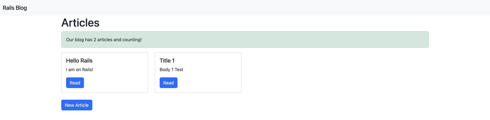

# README

## Ruby version
2.7.8

## System dependencies
- Ruby on Rails
- SQLite3

## Database creation
`$ bin/rails db:create`

## Database migration
`$ bin/rails db:migrate`

## Run server
`$ bin/rails s`

